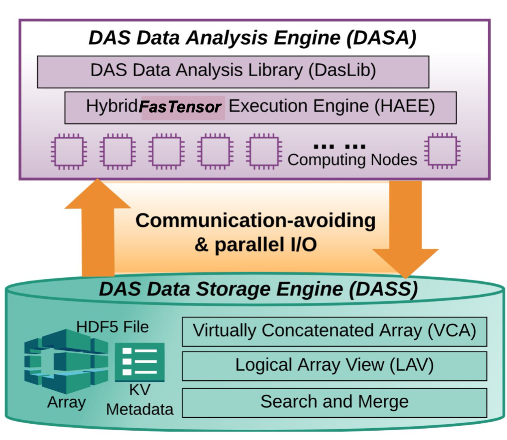

.. DASSA documentation master file, created by
   sphinx-quickstart on Thu May 19 15:04:50 2022.
   You can adapt this file completely to your liking, but it should at least
   contain the root `toctree` directive.

DASSA: Parallel DAS Data Storage and Analysis!
==============================================

DASSA provide an easy-to-use and scalable system for DAS data storage and analysis. A high-level overview of DASSA is presented in below figure.  

DASSA has two  major components: DAS data storage engine (DASS) and a DAS data analysis engine (DASA). 

 * DASS provides essential functions to search, merge (VCA) and subset (LAV) DAS data for analysis. DASS also provides a communication-avoiding parallel I/O method to reduce the cost of accessing DAS data stored in small files.
 
 * DASA contains a DAS data analysis library (DasLib) for popular DAS data processing operations. DASA also provides a hybrid FasTensor execution engine to run all these operations in parallel. Details of these sub-components are discussed in the following sections.

Installation 
--------------
.. toctree::
    :glob:

    install

Functions and their usage 
-------------------------
.. toctree::
    :glob:

    xcorrelation   
    stack
    decimate
    templatematch
    selfsimilarity
    compression

Indices and tables
==================

* :ref:`genindex`
* :ref:`modindex`
* :ref:`search`
