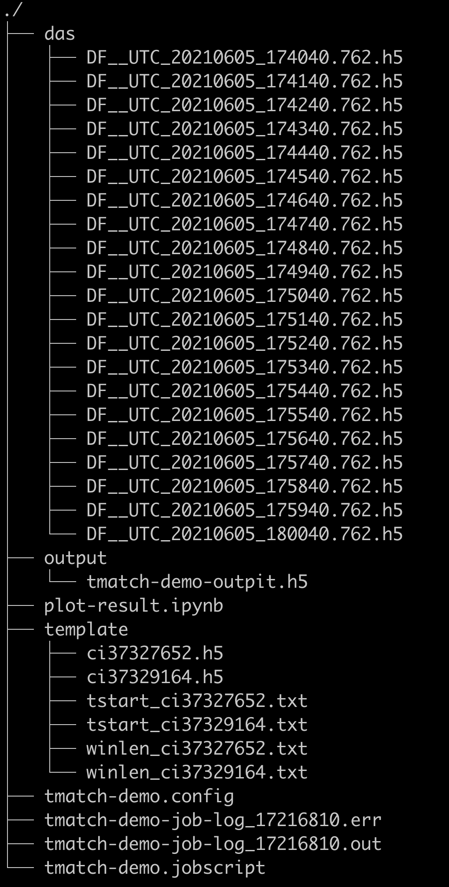
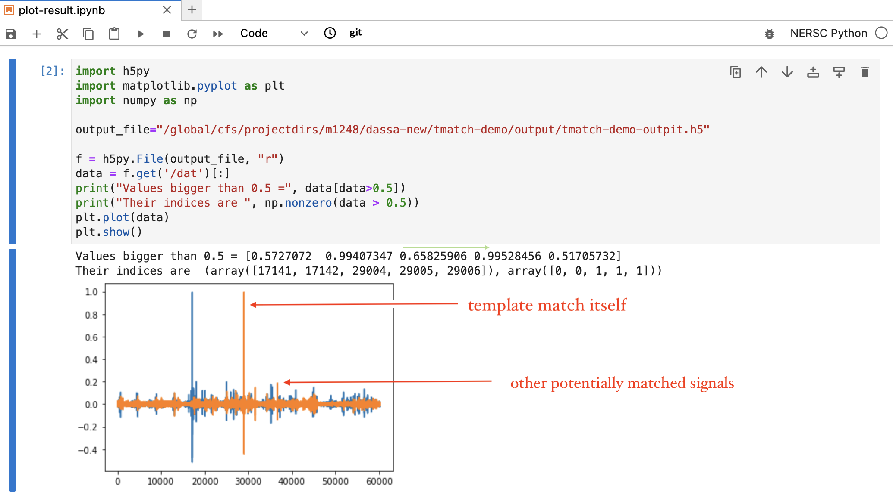
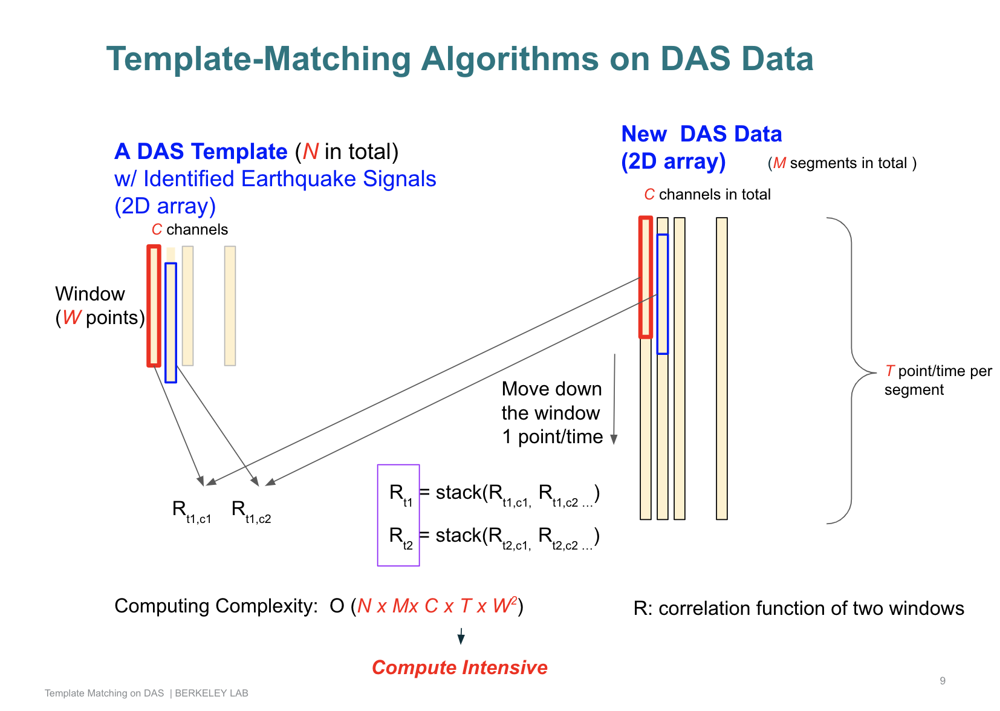
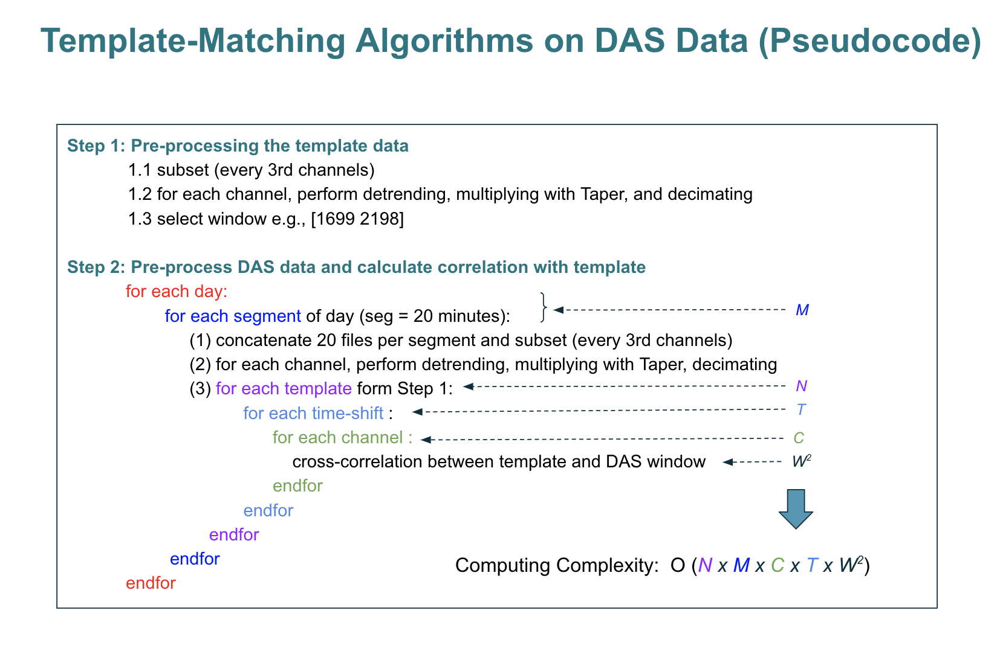

.. template-match:

Template Matching
=================

Template Matching contains a parallel template matching code (namely tmatch) on DAS data. 

Tables of contents of this page

- :ref:`1, Quick Start Example`
- :ref:`2, Configuration File`
- :ref:`3, Documentation for Functions within tmatch`

1, Quick Start Example 
----------------------

Below is a quick start example to run `tmatch` with the existing configuration file (tmatch-demo.config) in the repo. The tmatch accepts one parameter `-c` which comes with the configuration file name. 

Our test uses the below directory structure and files:

* **`template`** directory contains 2 templates. Within the directory, the ".h5" files contain the signal of the identified earthquake, the "tstart" files contain the start of the earthquake signals, the "winlen" files contains the length of the earthquake signals.
* **`das`** directory contains all DAS files to compare. By default, tmatch merges successive 20 files as a segment to compare.   Here we have 21 files in total because tmatch code has overlap (one monute) per segment. For example: segment 1 has files from the 1st file to 20th file + 21th file as the overlap.  In the example above, "DF__UTC_20210605_180040.762.h5" is the overlap file.  
* **`output`** directory contains the place to put the output files
* **`tmatch-demo.config`** file contains the parameters to run the code. Note that it can also be used to change `template` , `das`,  and `output` directory above. Next section has more details about the configuration files. 
* **`tmatch-demo.jobscript`** file contains the command to run the code. Here I used the script to run the code at Perlmutter HPC at NERSC through its job-scheduler SLURM. It can be changed to run the code on other HPC systems.  The run of the job produces two log files here: "tmatch-demo-job-log_17216810.out" and "tmatch-demo-job-log_17216810.err", where the former contains standard output from the code and the latter contains the standard error output if existing.  
* **`plot-result.ipynb`** is a simple python code to plot the results and help understand the outputs.

.. note::
  All above script files and configuration may contain a directory "/global/cfs/projectdirs/m1248/dassa-new/tmatch-demo" to help run the demo on Perlmutter HPC. One can easily change it to be your own directory.  

Below we give details of two methods to run the demo above.  

**Running Method 1: via job-scheduler**

.. code-block:: bash

  ## double-check the script
  >  more tmatch-demo.jobscript

  #!/bin/bash
  #SBATCH -C cpu
  #SBATCH -q debug
  #SBATCH -A m1248
  #SBATCH -N 1
  #SBATCH -t 00:15:00
  #SBATCH -J tmatch-demo
  #SBATCH -e tmatch-demo-job-log_%j.err
  #SBATCH -o tmatch-demo-job-log_%j.out
  #SBATCH -D /global/cfs/projectdirs/m1248/dassa-new/tmatch-demo

  export HDF5_USE_FILE_LOCKING=FALSE
  srun -n 1 /global/cfs/projectdirs/m1248/dassa-new/tmatch -c tmatch-demo.config

  ## submit the job to run on HPC
  >  sbatch tmatch-demo.jobscript

**Running Method 2: run the command directly**

One can also run the code directly if the system does not need to go through a job-scheduler like SLURM.

.. code-block:: bash

  > /global/cfs/projectdirs/m1248/dassa-new/tmatch -c tmatch-demo.config  

Sample output (take a look at "tmatch-demo-job-log_17216810.out" for full version if you run with HPC job-scheduler):

.. code-block:: bash

  Input parameters:
          template_dir = /global/cfs/projectdirs/m1248/dassa-new/tmatch-demo/template
          das_dir = /global/cfs/projectdirs/m1248/dassa-new/tmatch-demo/das
          das_file_type = EP_HDF5
          input_data_type = short
          is_column_vector = true
          is_template_file_range = 0
          is_das_file_range = 0
          is_channel_range = false
          is_channel_stride = false
          n_files_to_concatenate = 20

  Runtime parameters:
          DT = 0.002
          decifac = 10
          OpenMP_num_threads = 32
          correlation_method = 0 dot_product

  Output parameters:
          is_output_single_file = 1
          output_type = EP_HDF5
          output_file_dir = /global/cfs/projectdirs/m1248/dassa-new/tmatch-demo/output/tmatch-demo-outpit.h5
          output_dataset = /dat
          taperwidth     = 5
  ...
  ...  ignore other log outputs here
  ...

  Timing Results of All
  Read      time (s) : max = 47.1944, min = 47.1944, ave = 47.1944
  UDF       time (s) : max = 12.4286, min = 12.4286, ave = 12.4286
  Write     time (s) : max = 0.128686, min = 0.128686, ave = 0.128686

* Read time is the number seconds used to read data 
* UDF time is the number of seconds used to compute, i.e., find hidden signals with DAS files.
* Write time is the number of seconds used to write result file. 

Results of the running. 
By running the **`plot-result.ipynb`**. It produces the below results. Since this demo has two templates. The results is 2D array. The x-axis is the time and the y-axis is the correlation for templates. The peak has values close to 1, which shows the correlation between the templates and themselves.  Other peaks contain potential earthquakes with similarity to the templates. 

2, Configuration File
---------------------
Below is the content of the "tmatch-demo.config" file. Explanation of each parameter is added with comment. 

.. code-block:: bash

  #
  # Author Bin Dong  2023
  # This file demonstrates the usage of config file
  # Note:
  #  Each config file starts with the "[parameter]"
  #  The comment lines starting with "#" ";" and "%" will be skipped
  #  The ";" can also be used to comment the line at the end
  #
  #  In the blow text,
  #  -- I will use the "#" to comment a group of lines.
  #     We may have three groups, input parameter, output parameter and runtime parameter.
  #
  #  -- I will use the ";" to comment each line
  #
  # Also, all parameters have default values (even for the input file)
  #       So, some missing will not report the error.
  #       Todo: we may classify the parameter as optional ones or essential ones
  #
  #

  [parameter]

  #############################
  #   Input data's parameters #
  #############################

  template_dir = /global/cfs/projectdirs/m1248/dassa-new/tmatch-demo/template
                ; template_dir must have the following three types of files for each template
                ; ci39534271.h5 : template contains the seismic signal
                ; tstart_ci39534271.txt : start time of each template
                ; winlen_ci39534271.txt : window length

  das_dir = /global/cfs/projectdirs/m1248/dassa-new/tmatch-demo/das
            ; das_dir contains files of raw DAS data to compare

  das_file_type = EP_HDF5     ; only takes  EP_HDF5(default) / EP_TMDS

  das_h5_dataset=/Acoustic    ; dataset name in HDF5, use (h5dump -A) to get it

  das_data_type = short ;short (default)/double/float the data element type in dataset,

  is_column_vector = true ; true (default)/false
                          ; column vector: each column is a time series (most cases)
                          ; row vector: each row is a time series

  n_files_to_concatenate = 20 ; the number of files to concatenate into a segment
                            ; only works when input is a directory
                            ; 1 : not to concatenate
                            ; 2 : concatenate every two files ...
                            ; Note: better not to have leftover
                            ; Since there is the overlap of data across segments, be sure to have one extra file per segment

  is_input_search_rgx = false  ; true / false(default)
  input_search_rgx = (.*?)[1](\.h5) ; filter the input file names as input
                                    ; See : https://www.cplusplus.com/reference/regex/ECMAScript/

  is_channel_range = false   ;  true / false(default)
  channel_range_start = 0    ;  Select a few channels to run xcorr
  channel_range_end = 2      ;  channel_range_start is "0" based.

  is_channel_stride = false     ; true / false (default)
  channel_stride_size = 1       ; Only used when is_ch_stride = true
                        ; Pick every [ch_stride_size] channel from the first (zero based)
                        ; E.g.,  ch_stride_size = 99,
                        ; It picks channels 0, 99, 198, ....

  is_file_range = false      ; false or 0,  true/1 (by default 0)
                            ; only works when  is_input_single_file = flase, i.e., a directory
                            ; pick the [file_range_start_index]th file to  [file_range_end_index]th file
                            ; All files are sorted by the filenames (kind of time order)
  file_range_start_index = 0 ; Note: zero based and inclusive
  file_range_end_index = 4

  #####################################
  #        Output data's parameters   #
  #####################################

  is_output_single_file = true                     ; true / false(default)
  output_type = EP_HDF5                            ; only takes EP_HDF5 now
  output_file_dir = /global/cfs/projectdirs/m1248/dassa-new/tmatch-demo/output/tmatch-demo-outpit.h5

                                                  ; when is_output_single_file = false,  it points to a directory
  output_dataset = /dat                            ; dataset for output file

  is_dir_output_match_replace_rgx = false          ; true / false(default), only works in directory mode
                                                  ; whether it has a way to auto generate the output file
                                                  ; name from the input file name
  output_file_regex_match = ^(.*)\.h5$            ; regex pattern to match original file name
  output_file_regex_replace = $1-xcorr.h5          ; regex pattern to replace original file name

  ################################
  #      Runtime parameters      #
  ################################

  decifac = 10    ; decifac is the parameter to decimate each channel
  fbands = 0.5, 16 ; fbands is used by butter(2,fbands./(fs1/2),'bandpass')
  nlen_template = 2 ; LENGTH OF ORIGINAL TEMPLATE FILES - 2 MINUTES

 
  ##########################
  # Other Parameters       #
  ##########################

  #
  # These parameters are only needed when you want to specify the attribute names used for auto-layout detection
  # Another option is to set "is_column_vector = true/false", which will ignore the auto-layout detection
  #
  attribute_name_measure_length = MeasureLength[m]          ; the length of the fiber
  attribute_name_spatial_resolution = SpatialResolution[m]  ; the resolution of the fiber
  attribute_name_sampling_frequency = SamplingFrequency[Hz] ; the sampling frequency

3, Documentation for Functions within tmatch
--------------------------------------------

The high-level overview for the template-match on DAS data is presented in the below 

The pseudocode for the algorithm (non-prallel) is presented in below figure. 

  
Our tmatch has parallelized the code to reduce the time of execution. More details will be published in our upcoming research paper. 
   